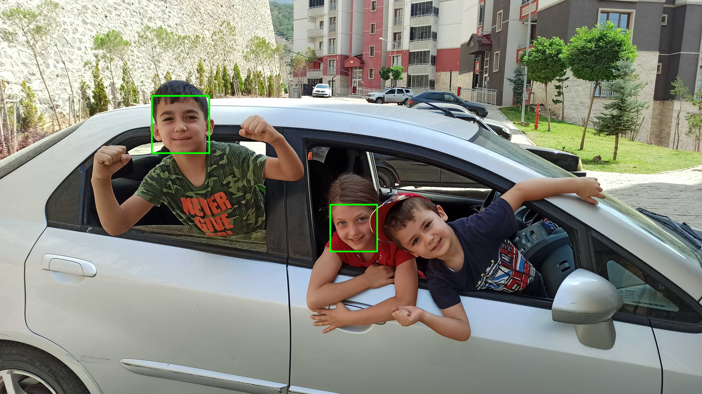

<h1>OpenCV'de Yüz Tespiti (Face Detection in OpenCV)</h1>
<h2>Haar Cascade ile Yüz Tespiti (Face Detection with Haar Cascade)</h4>

```
import cv2 as cv
print("[BİLGİ] Haar Cascade yüz tespit edici'yi yüklüyor...")
detector = cv.CascadeClassifier("haarcascade_frontalface_default.xml")
imgName, imgExtension = "IMG_20220824_111044", "jpg"
img = cv.imread(f"image/{imgName}.{imgExtension}")
# Haar Cascade gri tonlu resimler üzerinde çalıştığından renk uzay dönüşümü yapalım
gray = cv.cvtColor(img, cv.COLOR_BGR2GRAY)
print("[BİLGİ] Yüz tespiti gerçekleştiriliyor...")
scaleFactor, minNeighbors = 1.05, 35
rects = detector.detectMultiScale(gray, scaleFactor, minNeighbors)
print(f"[BİLGİ] {len(rects)} adet yüz tespit edildi.")
for (x,y,w,h) in rects:
    cv.rectangle(img, (x,y), (x+w,y+h), (0,255,0), 9)
s = 0.25 # resmi ekranda görüntülemek için ölçeklendir
rimg = cv.resize(img, (int(s*img.shape[1]), int(s*img.shape[0])), 0)
cv.imshow('Face detection with Haar Cascade', rimg)
cv.waitKey(0)
cv.imwrite(f"result/{imgName}_scaleFactor_{scaleFactor}_minNeighbors_{minNeighbors}.jpg", 
           img, [cv.IMWRITE_JPEG_QUALITY, 50])
```

<p align="center"></p>

<h4>Haar Cascade Metodu ile Web Kamerası Üzerinde Yüz Tespiti (ve FPS hesabı)</h4>

```
import cv2
import time
from collections import deque
import numpy as np
print('[INFO] loading haar cascade face detector...')
detector = cv2.CascadeClassifier('haarcascade_frontalface_default.xml')
cap = cv2.VideoCapture(1)
previousTime = time.time()
fps = deque(maxlen=100)
while True:
    ret, frame = cap.read()
    gray = cv2.cvtColor(frame, cv2.COLOR_BGR2GRAY)
    rects = detector.detectMultiScale(gray, scaleFactor=1.05, minNeighbors=5,
                                    minSize=(30,30), flags=cv2.CASCADE_SCALE_IMAGE)
    for (x,y,w,h) in rects:
        cv2.rectangle(frame, (x,y), (x+w,y+h), (0,255,0), 2)
    currentTime = time.time()
    fpsCurrent = 1 / (currentTime-previousTime)
    fps.append(fpsCurrent)
    fpsAvg = np.mean(fps)
    cv2.putText(frame, 'fps = %.2f' %fpsAvg, (420,30), 0, 1, (0,0,0), 2)
    cv2.imshow('web kamerasi video', frame)
    previousTime = currentTime
    if cv2.waitKey(1) & 0xFF == ord('q'): # eğer bir an bile q'ya basarsa
        cv2.imwrite('face detection haar cascade web cam.jpg', frame, [cv2.IMWRITE_JPEG_QUALITY, 100])
        break
cap.release()
cv2.destroyAllWindows()
```

<h2>Derin Öğrenme ile Yüz Tespiti (Face Detection with Deep Learning)</h2>
<p align="justify">Burada referans alacağımız tutorial [10]'da Adrian tarafından hazırlanmış. Normalde OpenCV harika bir kütüphane olduğundan böyle tutorial'lar olmadan bile (ne yapacağınızı bildiğiniz takdirde) kendi kodunuzu <a href="https://docs.opencv.org/">OpenCV dökümantasyonu</a>ndan faydalanarak rahatça yazabilirsiniz. Ancak burada bu durum söz konusu değil. Adım adım Adrian'ı takip edeceğiz.</p>

<p align="justify">Adrian OpenCV'nin 2017 Ağustos'unda Deep Neural Network (dnn) ana modülünü (ekstra bir modül değil de standart bir modül olarak) hizmete sunduğunu ve bu modülün içinde derin öğrenme kullanan yüz tespiti metodları olduğunu söylüyor. Bunlardan bir tanesi <a href="https://github.com/arrybn">Aleksandr Rybnikov</a> tarafından OpenCV dnn modülüne dahil edilen ResNet tabanlı bir derin öğrenme yüz tespit metodu. Bu metod popüler yapay zeka kütüphanelerinden biri olan <a href="https://caffe.berkeleyvision.org/">Caffe</a>'den model mimarisini ve eğitilmiş modelin ağırlıklarını transfer ederek görüntüdeki yüzleri oldukça yüksek bir performansla tespit ediyor.</p>

<h3>Referanslar</h3>
<ol>
    <li>OpenCV'de <b>Haar Cascade</b> Metodu ile Yüz Tespiti [A. Rosebrock, pyimagesearch.com] - https://www.pyimagesearch.com/2021/04/05/opencv-face-detection-with-haar-cascades/</li>
    <li>Haar Cascade ile Yüz ve Göz Tespiti (OpenCV tutorial) - https://docs.opencv.org/4.x/db/d28/tutorial_cascade_classifier.html</li>
    <li>OpenCV'de Derin Öğrenme ile Yüz Tespiti [A. Rosebrock, pyimagesearch.com] - https://pyimagesearch.com/2018/02/26/face-detection-with-opencv-and-deep-learning/</li>
    <li>OpenCV'de <b>VideoWrite()</b> komutuyla video oluşturma - https://docs.opencv.org/4.x/dd/d43/tutorial_py_video_display.html</li>
    <li>OpenCV'de <b>imageio</b> paketiyle <b>gif</b> animasyon yapma - https://pysource.com/2021/03/25/create-an-animated-gif-in-real-time-with-opencv-and-python/</li>
</ol>
