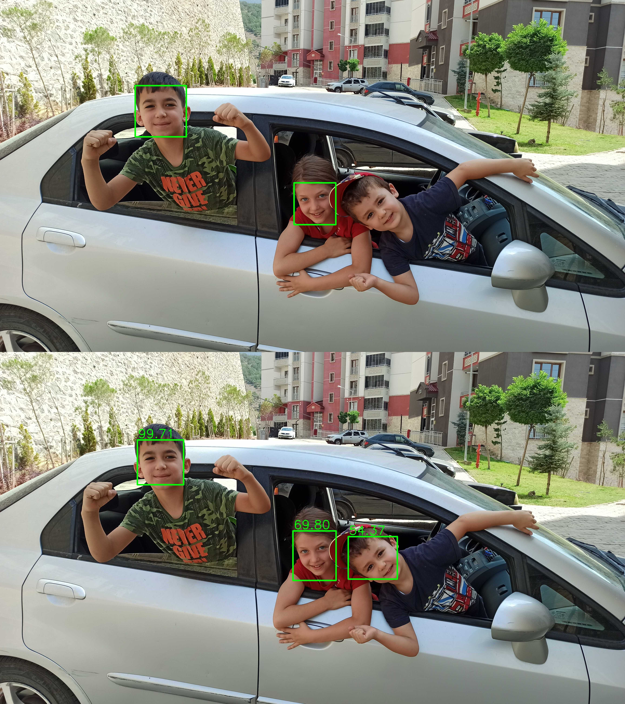

<h1>OpenCV'de Yüz Tespiti (Face Detection in OpenCV)</h1>
<p align="justify">Burada bahsedeceğimiz iki metottan Haar Cascade (HC) ismiyle anılan makine öğrenmesi metodu aynı zamanda Viola - Jones metodu olarak da biliniyor [1,2]. Bu metot Haar-like özniteliklerini (features) kullanarak oldukça başarılı bir biçimde nesne tespiti (object detection) yapabiliyor. Burada bu tekniği yüz tespitinde kullanacak olsak da HC başka işlerde de başarıyla kullanılabiliyor (eğer OpenCV'yi Windows bilgisayarınıza Anaconda platformu kullanarak <b>opencv-env</b> isminde bir sanal ortama yüklediyseniz C:\Users\XYZ\anaconda3\envs\opencv-env\Lib\site-packages\cv2\data dizininde (kullanıcı isminiz XYZ) çeşitli HC nesne tespit etme dosyalarını e.g., göz tespiti (eye detection), gülümseme tespiti (smile detection), plaka tespiti (license plate detection) görebilirsiniz). Bu metodun en çok tercih edilme nedeni modern metotlara göre daha basit olması ve işlemcilerde hızlı bir biçimde koşabilmesi. Bu da sınırlı işlemci gücüne sahip donanımlarda bu metodu ilgili problemlerde ilk tercih haline getiriyor.</p>

<h2>Haar Cascade ile Yüz Tespiti (Face Detection with Haar Cascade)</h2>

<p align="justify">Aşağıdaki Haar Cascade ile yüz tespiti kodunda iki adet ayarlanabilir parametre var. Bunların isimleri <b>scaleFactor</b> ve <b>minNeighbors</b>. Bunları değiştirerek elde edilecek yüz tespiti sonuçlarını değiştirebilirsiniz.</p>

<b>face_detection_HC_image.py</b>

```
import cv2
print("[BİLGİ] Haar Cascade yüz tespit edici'yi yüklüyor...")
detector = cv2.CascadeClassifier("haarcascade_frontalface_default.xml")
imgName = "IR_00197.png"
imgName, imgExtension = imgName.split('.')
img = cv2.imread(f"image/{imgName}.{imgExtension}")
# Haar Cascade gri tonlu resimler üzerinde çalıştığından renk uzayı dönüşümü yapalım
gray = cv2.cvtColor(img, cv2.COLOR_BGR2GRAY) # RGB uzaydan gri tonlu uzaya dönüşüm
print("[BİLGİ] Yüz tespiti gerçekleştiriliyor...")
scaleFactor, minNeighbors = 1.05, 25 # iki adet ayarlanabilir parametre
rects = detector.detectMultiScale(gray, scaleFactor, minNeighbors)
print(f"[BİLGİ] {len(rects)} adet yüz tespit edildi.")
# tespit edilen yüzleri resim üzerinde dikdörtgen olarak göster
for (x,y,w,h) in rects:
    cv2.rectangle(img, (x,y), (x+w,y+h), (0,255,0), 9)
s = 0.25 # s=(0-1] resmi ekranda görüntülemek için ölçeklendir
rimg = cv2.resize(img, (int(s*img.shape[1]), int(s*img.shape[0])), 0)
cv2.imshow('Face detection with Haar Cascade', rimg)
cv2.waitKey(0)
cv2.imwrite(f"result/{imgName}_scaleFactor_{scaleFactor}_minNeighbors_{minNeighbors}.jpg", 
           img, [cv2.IMWRITE_JPEG_QUALITY, 50])
```

<p align="center"></p>

<h2>Derin Öğrenme ile Yüz Tespiti (Face Detection with Deep Learning)</h2>
<p align="justify">Burada referans alacağımız tutorial [3]'te PyImageSearch kurucusu Adrian Rosebrock tarafından hazırlanmış. Normalde OpenCV harika bir kütüphane olduğundan böyle tutorial'lar olmadan bile (ne yapacağınızı bildiğiniz takdirde) kendi kodunuzu <a href="https://docs.opencv.org/">OpenCV dökümantasyonu</a>ndan faydalanarak rahatça yazabilirsiniz. Ancak burada bu durum söz konusu değil. Adım adım Adrian'ı takip edeceğiz.</p>

<p align="justify">Adrian OpenCV'nin 2017 Ağustos'unda Deep Neural Network (dnn) ana modülünü (ekstra bir modül değil de standart bir modül olarak) hizmete sunduğunu ve bu modülün içinde derin öğrenme kullanan yüz tespiti metodları olduğunu söylüyor. Bunlardan bir tanesi <a href="https://github.com/arrybn">Aleksandr Rybnikov</a> tarafından OpenCV dnn modülüne dahil edilen ResNet tabanlı bir derin öğrenme yüz tespit metodu. Bu metot, popüler yapay zekâ kütüphanelerinden biri olan <a href="https://caffe.berkeleyvision.org/">Caffe</a>'den model mimarisini ve eğitilmiş modelin ağırlıklarını transfer ederek (aynen Haar Cascade metodunda olduğu gibi pre-trained yâni bize hazır verilen bir model kullanacağız) görüntüdeki yüzleri oldukça yüksek bir performansla tespit ediyor.</p>

<p align="justify">Aşağıda verilen derin öğrenme ile yüz tespiti kodunda bir adet ayarlanabilir parametre var. İsmi <b>conf</b> olan bu parametre (0,1] aralığında değiştirildiğinde çıktı olarak bize verilen yüz tespit edilme resmi üzerindeki sonuçlar değişiyor. Mesela <b>conf=0.5</b> olduğunda derin öğrenme modeli ile tespit edilen yüzlerden yüz olma olasılığı %50'nin üzerinde olanlar sonuçta çizdiriliyor. Buradan hareketle eğer yüz olduğunu bildiğiniz bir bölge çizdirilmemişse (bu hataya True-Negative deniyor) o zaman <b>conf</b> değerini azaltarak tespit edilemeyen o yüzü tespit etmeye çalışabilirsiniz. Benzer bir mantıkla eğer yüz olmayan bir bölge yüz diye çizdirilmişse (bu hataya yanlış alarm mânâsına False-Positive deniyor) o zaman da <b>conf</b> değerini yükselterek bu hatadan kurtulmaya çalışabilirsiniz.</p>

<b>face_detection_DL_image.py</b>

```
import cv2
import numpy as np

# load our serialized dnn model from disk
print("[BİLGİ] derin öğrenme modeli olan ResNet'i Caffe kütüphanesinden yüklüyor...")
net = cv2.dnn.readNetFromCaffe('deploy.prototxt.txt', 'res10_300x300_ssd_iter_140000.caffemodel')
conf = 0.5 # minimum probability to filter weak detections
# load the input image and construct an input blob for the image
# by resizing to a fixed 300x300 pixels and then normalizing it
imgName = "IMG_20220824_111044.jpg"
imgName, imgExtension = imgName.split('.')
img = cv2.imread(f'image/{imgName}.{imgExtension}')
(h, w) = img.shape[:2]
blob = cv2.dnn.blobFromImage(cv2.resize(img, (300, 300)), 1.0,
	(300, 300), (104.0, 177.0, 123.0))
# pass the blob through the network and obtain the detections and predictions
print("[BİLGİ] yüz tespiti yapılıyor...")
net.setInput(blob)
detections = net.forward()
# loop over the detections
for i in range(0, detections.shape[2]):
	# extract the confidence (i.e., probability) associated with the prediction
	confidence = detections[0, 0, i, 2]
	# filter out weak detections by ensuring the `confidence` is
	# greater than the minimum confidence
	if confidence > conf:
		# compute the (x, y)-coordinates of the bounding box for the object
		box = detections[0, 0, i, 3:7] * np.array([w, h, w, h])
		(startX, startY, endX, endY) = box.astype("int")
		# draw the bounding box of the face along with the associated probability
		text = f"{confidence*100:.2f}"
		y = startY - 10 if startY - 10 > 10 else startY + 10
		color = (0, 255, 0) # BGR order
		cv2.rectangle(img, (startX, startY), (endX, endY), color, 10)
		cv2.putText(img, text, (startX+5, y-5), 0, 3, color, 6)
# save output image
cv2.imwrite(f"result/{imgName}_conf_{conf}.jpg", img, [cv2.IMWRITE_JPEG_QUALITY, 50])
# show the output image
s = 0.2
rimage = cv2.resize(img, (int(s*img.shape[1]), int(s*img.shape[0])), cv2.INTER_LINEAR)
cv2.imshow("Face detection with deep learning", rimage)
cv2.waitKey(0)
```

<h2>Haar Cascade ile Web Kamerası Üzerinde Yüz Tespiti</h2>

<p>Aşağıdaki kodda görülen <b>showFPS</b> ve <b>showFrameNumber</b> Boolean değişkenlerini ayarlayarak görüntünün üstünde ortalama fps ve kare numarası görüntüleyip görüntülememeyi ayarlayabilirsiniz.</p>

<b>face_detection_HC_web_cam.py</b>

```
import cv2
import time
from collections import deque
import numpy as np
print('[INFO] loading haar cascade face detector...')
detector = cv2.CascadeClassifier('haarcascade_frontalface_default.xml')
cap = cv2.VideoCapture(0)
fps = deque(maxlen=100)
k = 0 # initialize frame number counting index
showFPS, showFrameNumber = True, True # decide if you like to show fps count or not, frame number
previousTime = time.time() # capture timestamp to initialize fps computation
while True:
    ret, frame = cap.read()
    k = k+1
    gray = cv2.cvtColor(frame, cv2.COLOR_BGR2GRAY)
    rects = detector.detectMultiScale(gray, scaleFactor=1.05, minNeighbors=5, minSize=(30,30), flags=cv2.CASCADE_SCALE_IMAGE)
    for (x,y,w,h) in rects:
        cv2.rectangle(frame, (x,y), (x+w,y+h), (0,255,0), 2)
    currentTime = time.time()
    fpsCurrent = 1 / (currentTime-previousTime)
    fps.append(fpsCurrent)
    fpsAvg = np.mean(fps)
    if showFPS:
        cv2.putText(frame, f"fps = {fpsAvg:.2f}", (30,50), 0, 1, (0,0,0), 2)
    if showFrameNumber:
        cv2.putText(frame, f"frame #{k}", (frame.shape[1]-215,50), 0, 1, (0,0,0), 2)
    cv2.imshow('Web cam stream with Haar Cascade face detection', frame)
    previousTime = currentTime
    if cv2.waitKey(1) & 0xFF == ord('c'): # kullanıcı c tuşuna basarsa görüntüyü kaydet
        cv2.imwrite(f"result/haar_cascade_face_detection_frame_{k}.jpg", frame, [cv2.IMWRITE_JPEG_QUALITY, 100])
        print(f"Frame #{k} is saved to hard disk.")
    elif cv2.waitKey(1) == 27:
        break
cap.release()
cv2.destroyAllWindows()
```


<h2>Derin Öğrenme ile Web Kamerası Üzerinde Yüz Tespiti</h2>

<p>Yukarıdakine benzer biçimde, aşağıdaki kodda görülen <b>showFPS</b> ve <b>showFrameNumber</b> Boolean değişkenlerini ayarlayarak görüntünün üstünde ortalama fps ve kare numarası görüntüleyip görüntülememeyi ayarlayabilirsiniz.</p>

<b>face_detection_DL_web_cam.py</b>

```
import numpy as np
import time
import cv2
from collections import deque

# load our serialized model from disk
print("[INFO] loading model...")
net = cv2.dnn.readNetFromCaffe('deploy.prototxt.txt', 'res10_300x300_ssd_iter_140000.caffemodel')
conf = 0.5 # minimum probability to filter weak detections
cap = cv2.VideoCapture(0)
fps = deque(maxlen=100)
k = 0 # index for saving screenshot to file
previousTime = time.time() # capture timestamp to initialize fps computation
showFPS, showFrameNumber = True, True # decide if you like to show fps count or not, frame number
while True:
	ret, frame = cap.read()
	k = k+1
	# grab the frame dimensions and convert it to a blob
	(h,w) = frame.shape[:2]
	blob = cv2.dnn.blobFromImage(cv2.resize(frame, (300, 300)), 1.0,
		(300, 300), (104.0, 177.0, 123.0))
	# pass the blob through the network and obtain the detections and predictions
	net.setInput(blob)
	detections = net.forward()
	# loop over the detections
	for i in range(0, detections.shape[2]):
		# extract the confidence (i.e., probability) associated with the prediction
		confidence = detections[0, 0, i, 2]
		# filter out weak detections by ensuring the `confidence` is
		# greater than the minimum confidence
		if confidence < conf:
			continue
		# compute the (x,y)-coordinates of the bounding box for the object
		box = detections[0, 0, i, 3:7] * np.array([w, h, w, h])
		(startX, startY, endX, endY) = box.astype("int")
		# draw the bounding box of the face along with the associated probability
		text = "{:.2f}%".format(confidence * 100)
		y = startY - 10 if startY - 10 > 10 else startY + 10
		cv2.rectangle(frame, (startX,startY), (endX,endY), (0, 0, 255), 2)
		cv2.putText(frame, text, (startX,y), cv2.FONT_HERSHEY_SIMPLEX, 0.45, (0, 0, 255), 2)
	currentTime = time.time()
	fpsCurrent = 1 / (currentTime - previousTime)
	fps.append(fpsCurrent)
	fpsAvg = np.mean(fps)
	if showFPS:
		cv2.putText(frame, f"fps = {fpsAvg:.2f}", (30,50), 0, 1, (0,0,0), 2)
	if showFrameNumber:
		cv2.putText(frame, f"frame #{k}", (frame.shape[1]-215,50), 0, 1, (0,0,0), 2)
	cv2.imshow("face detection with deep learning", frame)
	previousTime = currentTime
	if cv2.waitKey(1) & 0xFF == ord('c'): # kullanıcı c tuşuna basarsa görüntüyü kaydet
		cv2.imwrite(f"result/deep_learning_face_detection_frame_{k}.jpg", frame, [cv2.IMWRITE_JPEG_QUALITY, 100])
		print(f"Frame #{k} is saved to hard disk.")
	elif cv2.waitKey(1) == 27:
		break
cap.release()
cv2.destroyAllWindows()
```


<h3>Referanslar</h3>
<ol>
    <li align="justify"><a href="https://ieeexplore.ieee.org/abstract/document/990517" blank="_target">P. Viola and M. Jones, "Rapid object detection using a boosted cascade of simple features," <i>Proceedings of the 2001 IEEE Computer Society Conference on Computer Vision and Pattern Recognition. CVPR 2001</i>, Kauai, HI, USA, 2001, pp. I511-I518.</a></li>
    <li align="justify"><a href="https://link.springer.com/article/10.1023/b:visi.0000013087.49260.fb#citeas" target="_blank">Viola, P., Jones, M.J. Robust Real-Time Face Detection. International Journal of Computer Vision 57, 137–154 (2004).</a></li>
    <li align="justify"><a href="https://www.pyimagesearch.com/2021/04/05/opencv-face-detection-with-haar-cascades/" target="_blank">OpenCV'de <b>Haar Cascade</b> Metodu ile Yüz Tespiti [A. Rosebrock, PyImageSearch]</a></li>
    <li align="justify"><a href="https://docs.opencv.org/4.x/db/d28/tutorial_cascade_classifier.html" target="_blank">Haar Cascade ile Yüz ve Göz Tespiti (OpenCV tutorial)</a></li>
    <li><a href="https://pyimagesearch.com/2018/02/26/face-detection-with-opencv-and-deep-learning/" target="_blank">OpenCV'de Derin Öğrenme ile Yüz Tespiti [A. Rosebrock, PyImageSearch]</a></li>
</ol>
